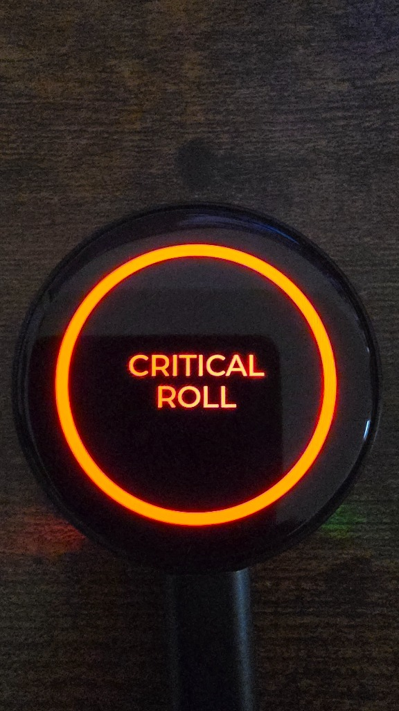
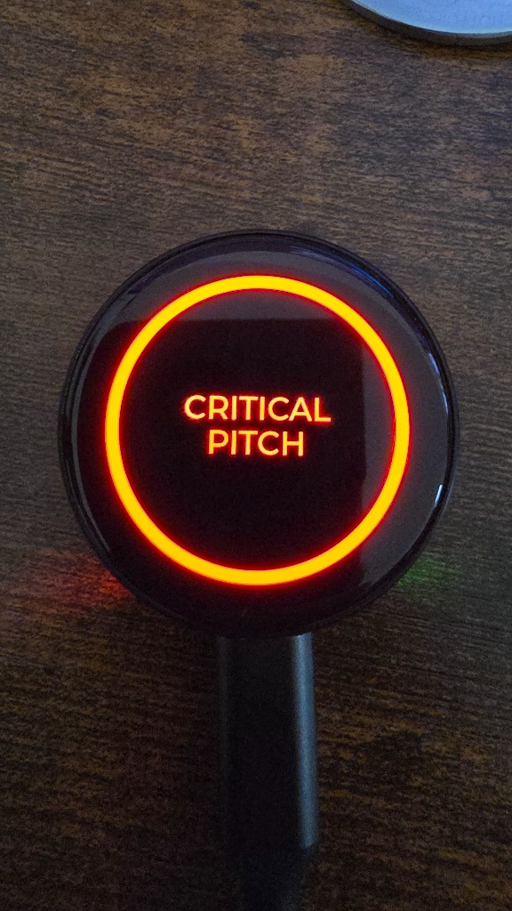
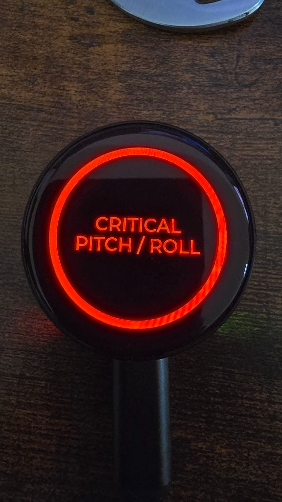
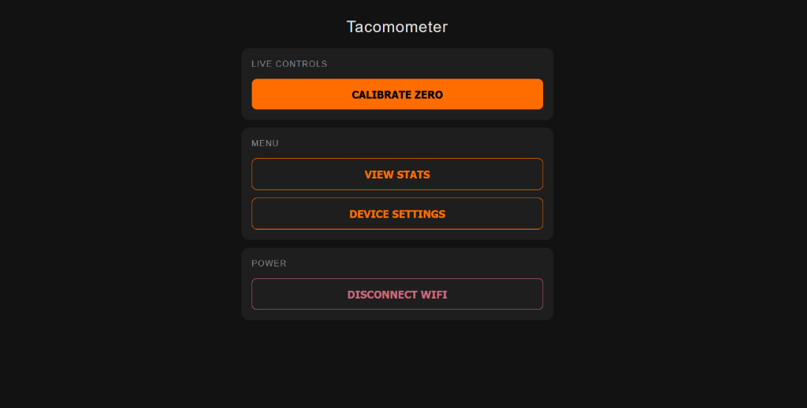
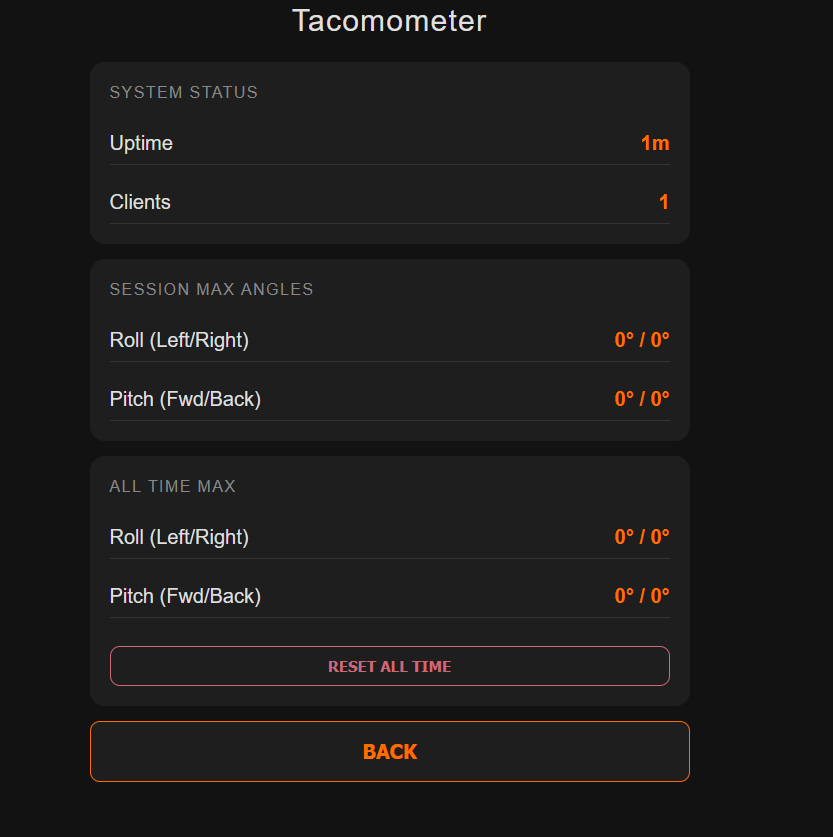
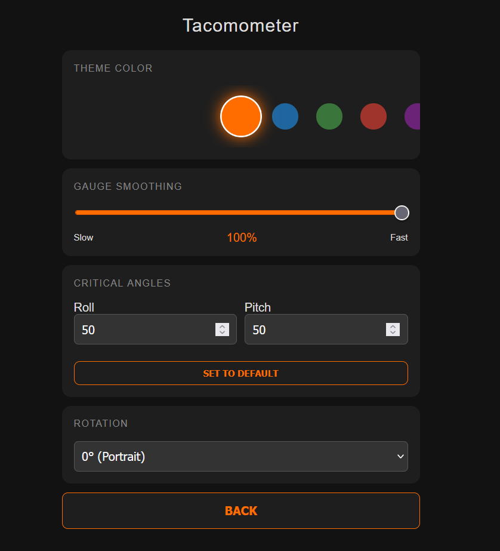
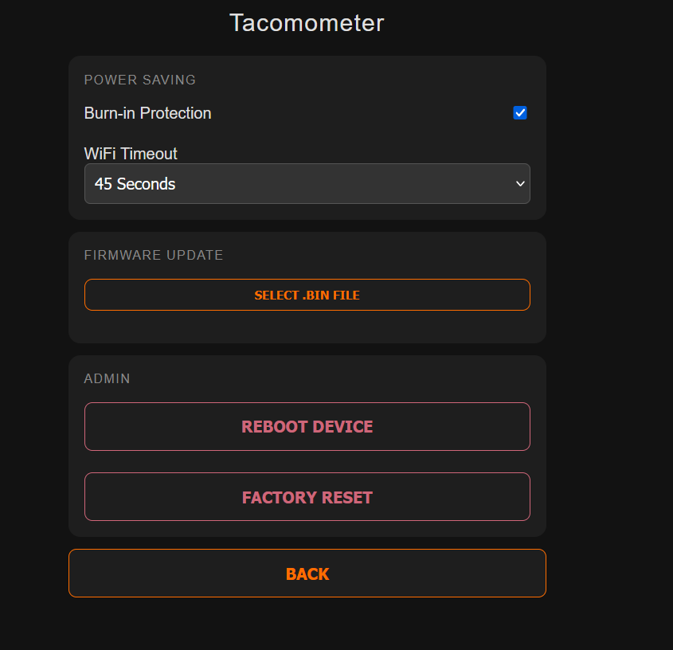

# Tacomometer

**The Tacoma-Themed Digital Inclinometer**

A high-performance digital inclinometer for off-road enthusiasts, designed with the aesthetic of the 2nd Gen Toyota Tacoma. Built for the **Waveshare ESP32-C6-Touch-AMOLED-1.43** circular display, it features smooth 60FPS animations, accurate pitch and roll tracking, and customizable alerts.

  
  
  

## Features

- **Retro-Modern Design:** Inspired by the 2nd Gen Tacoma instrument cluster.
- **High Performance:** Leveraging LVGL v9 for buttery smooth gauge movement (20Hz+ update rate).
- **Dual Axis:** Real-time Pitch and Roll monitoring.
- **Max Angle Memory:** Tracks and displays the maximum angles reached during a session.
- **Pixel Shifting:** Active burn-in protection for AMOLED displays (shifts UI pixels periodically).
- **Gauge Smoothing:** Configurable Exponential Moving Average (EMA) filter for steady readings.
- **Advanced Stats:** Tracks Session Max and All-Time Max angles, plus system uptime and client count.
- **Web Interface:**
  - **Live Calibration**
  - **Dynamic Theme:** Choose from 6+ Tacoma-inspired colors.
  - **OTA Updates:** Wirelessly update firmware.
  - **Configurability:** Adjust Critical Angles, Wi-Fi Timeout, and Smoothing.

  

    
    
  

  

    
    
  

- **Touch Calibration:** Long-press screen to zero.
- **Dynamic Alerts:**
  - **Warning (Red Pulse):** > 30°
  - **Critical (Red Flashing):** > User Configurable (Default 50°)

## Hardware Requirements

- **Microcontroller & Display:** [Waveshare ESP32-C6-Touch-AMOLED-1.43](https://www.waveshare.com/wiki/ESP32-C6-Touch-AMOLED-1.43)
- **IMU Sensor:** QMI8658 (or similar 6-axis IMU supported by the driver).
- **Power:** 5V USB-C or 3.7V LiPo Battery.

## remote Control (Offline Mobile App)

The device features a built-in Wi-Fi Access Point and Web Interface for remote calibration and settings.

### How to Connect
1.  **Activate:** Press and **HOLD** the BOOT button (on the back/side) for **2 seconds**.
2.  **Pair:** A specific "Ready to Pair" toast message will appear. Connect your phone to the Wi-Fi network: `Tacomometer`.
3.  **Control:** Open a web browser and navigate to `http://192.168.4.1`.
4.  **Calibrate:** Use the "Calibrate" button on the mobile interface to zero the inclinometer remotely.
5.  **Disconnect:** Press the BOOT button again (short press) or use the "Disconnect" button in the app to turn off Wi-Fi.

## OTA Firmware Updates

You can update the device firmware wirelessly without removing it from the vehicle.

1.  **Export Binary:** In Arduino IDE, go to `Sketch -> Export Compiled Binary` to create a `.bin` file.
2.  **Connect:** Connect to the `Tacomometer` Wi-Fi network.
3.  **Navigate:** Go to `http://192.168.4.1` and click on **Device Settings**.
4.  **Upload:** Scroll to **Firmware Update**, select your `.bin` file, and click **Flash**.
5.  **Wait:** The device will upload the file and automatically reboot into the new version.

| Sensor Pin | ESP32 Pin | Description |
| :--- | :--- | :--- |
| **VCC** | 3.3V | Power |
| **GND** | GND | Ground |
| **SDA** | GPIO 18 | I2C Data |
| **SCL** | GPIO 8 | I2C Clock |

## Installation

### Prerequisites

1. **VS Code** with **PlatformIO** (Recommended) OR **Arduino IDE**.
2. **Drivers:** Ensure you have the USB-Serial drivers for the ESP32-C6.

### Arduino IDE Setup

1. Install the **ESP32** board package (v3.0.0+ for ESP32-C6 support) in Board Manager.
2. Select Board: `ESP32C6 Dev Module`.
3. Enable "USB CDC On Boot".
4. Install Required Libraries:
   - `lvgl` (v9.x)
   - `Arduino_GFX_Library` (if used for low-level bus)
   - `SensorQMI8658` (or your specific IMU library)
5. Open `Tacomometer.ino` and upload.

### Configuration

All pin definitions and hardware settings are located in `src/board_config.h`.

## Usage

1. **Mounting:** Mount the device securely in your vehicle.
2. **Power On:** Connect to USB or battery.
3. **Calibration:**
   - Park on a flat, level surface.
   - **Long Press** anywhere on the screen for 2 seconds.
   - The status text will show "CALIBRATING..." and the gauges will reset to 0°.
4. **Drive:** The max indicators (red dots) will track your most extreme angles.

## Customization

### Customization

#### Assets
The project uses python scripts to generate C arrays from images.
1. Place your images in `assets/`.
2. Run `python scripts/generate_assets.py`.
3. Recompile the project.

**Note:** The folder `assets_backup/` contains the default assets (C arrays) for the project. These can be restored if experimental asset generation fails or if you want to revert to the original look without regenerating.

## License

This project is licensed under the **Creative Commons Attribution-NonCommercial-ShareAlike 4.0 International (CC BY-NC-SA 4.0)**.

### Summary of Rights:
- **✅ You CAN:** Download, use, modify, and share this software for **Personal Use**.
- **✅ You CAN:** Share adapted versions, provided they use the **same license**.
- **❌ You CANNOT:** Sell this software or physical products containing this software for **Commercial Purposes** without explicit permission from the author.

## Credits
- Built with [LVGL](https://lvgl.io/).
- Developed by **zzackk125**.
